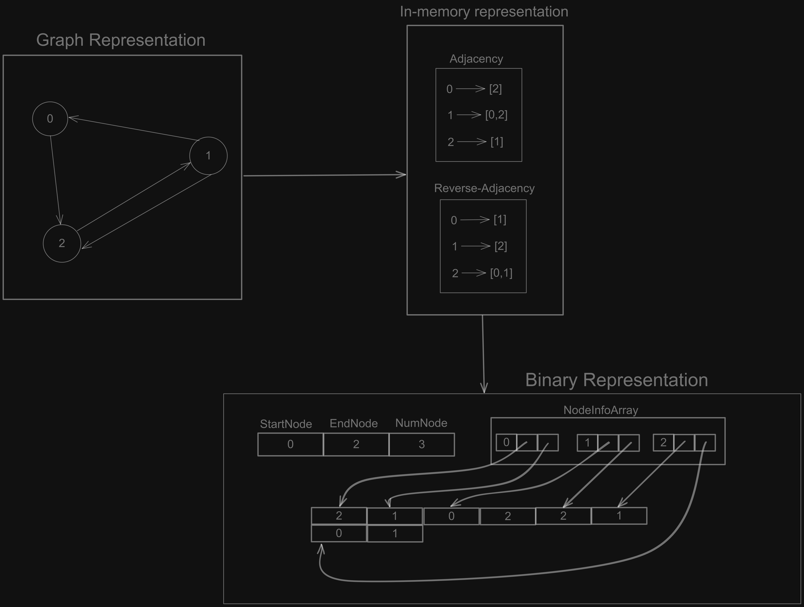

# Binary Graph Storage
This repository contains a binary storage format for directed graphs.

## Representation format

The above diagram illustrates the binary representation of a simple graph. This graph has 3
nodes and 4 edges. This graph is first converted to an in-memory representation which contains
an adjacency list with the list of outgoing edges and a reverse adjacency with the list of
incoming edges. This representation is then converted into the binary format mentioned in the
bottom-right of the figure.

Lets take a closer look at the format. TODO 
